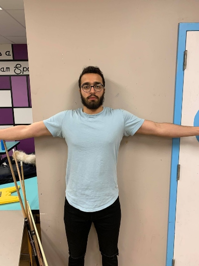
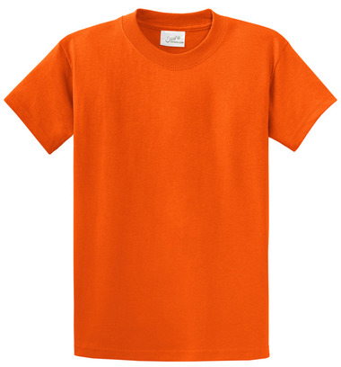
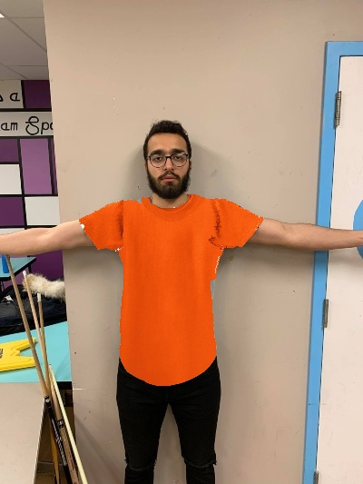
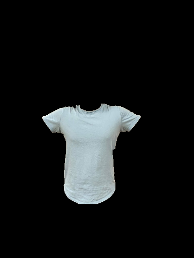

## Clothing Companion

This is the script for clothing companion. Due to schedule and coronavirus the script there has been heavily modified many times and inspirations have been taken from other sources. We truly believe that this project has great potentials and future and given enough resources and times, a well-crafted product can be achieved. As the project requires us to make a final deliverable, this is our take at the project given the situation we are faced with.

1. A user uploads an image like so,



An item of clothing like below,



2. The output would look like below,



### Requirements

The code requires `python 2.7`, `opencv` and `numpy` to run.

### Usage

There are limitations and presumptions that are made before using this project, therefore it is recommended to use the example pictures as a guideline until further refineries are made to the code.

For extracting the outline of the topwear worn by the user from the user image, we used grabcut foreground segmentation, specifically the code sample provided by opencv.

To fit a tshirt on a user image, use the `topWearWrapper.py` script. To execute 

```
$ python topWearWrapper.py [path to user image] [path to apparel image] 1
```

Follow the easy steps on the terminal to achieve your desired outcome. The image below represents the mask generated for the input image above. 




Once the user has achieved masking through the script, a grabcut will be saved as a reference in the debug folder and now the user can run the script with the third argument being 0 and not having to go through the entire process again.


